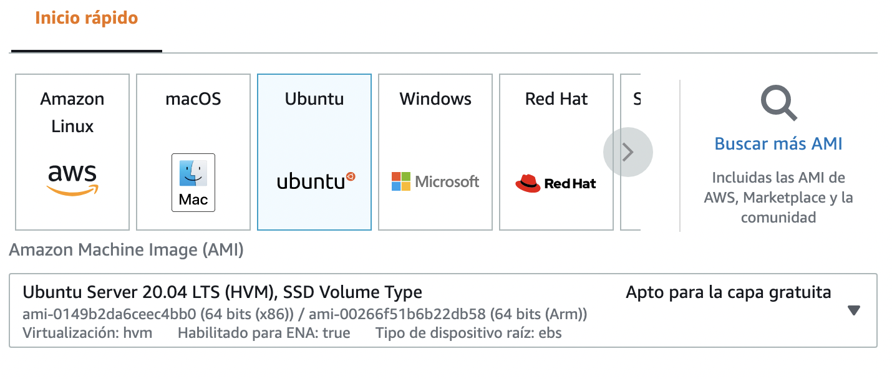
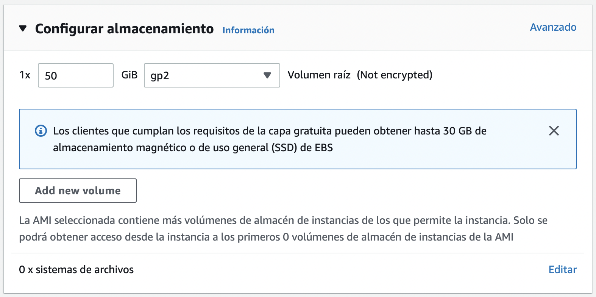
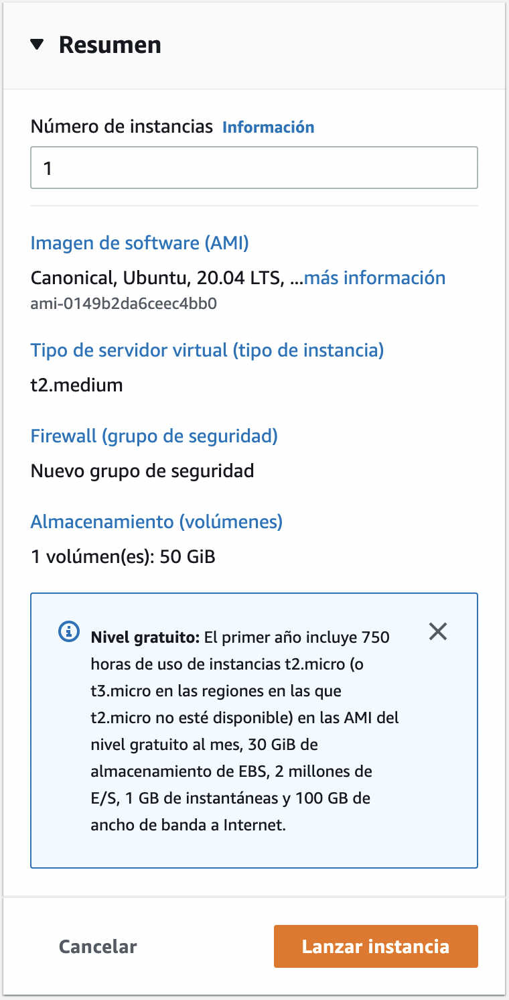
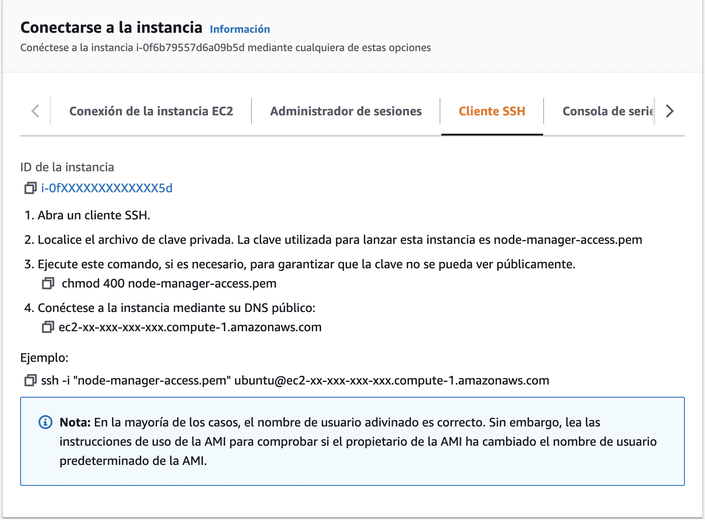

Creando una instancia Ubunto en AWS EC2
===

Si ya tienes una cuenta de AWS, puedes brincar a la sección [Creando un usuario para EC2](#creando-un-usuario-para-ec2).

Para el curso creamos una cuenta totalmente nueva para apoyar a todos los que están utilizando por primera vez AWS.

## Habilitar 2FA
AWS es una plataforma ocupada masivamente por un gran número de desarrolladores en el mundo, lo que la convierten también en un servicio altamente vulnerable si no se siguen ciertas medidas de seguridad básicas, así que recomendamos ampliamente habilitar el factor de doble autenticación (2FA) a la cuenta Root.

## Usuario con permisos limitados

Ahora crearemos un nuevo usuario con permisos limitados para continuar con el curso y así reducir vulnerabilidades.

Ingresamos a la sección Usuarios, seleccionamos Crear Usuario.

En la siguiente página solicitará asignar permisos al usuario, vamos a utilizar la opción de crear un nuevo grupo de permisos.

Nombraremos al grupo con algo que nos ayude a entender de qué va ese grupo de permisos, por ejemplo: NodeManager

Ahora colocaremos en el buscador la palabra clave Ec2FullAccess y seleccionaremos el permiso.

Sería mejor limitar los permisos al mínimo, pero con fines de velocidad y simplicidad para el curso seleccionaremos Ec2FullAccess

En la siguiente sección "Establecer un límite de permisos" seleccionaremos "Utilice un límite de permisos…" y volveremos a seleccionar EC2FullAccess y "Siguiente: Etiquetas".

En etiquetas no es necesario que agreguemos nada, continuamos.

Ahora podemos ver un resumen de las opciones seleccionadas, verificamos que todo esté correcto y con permisos limitados y continuamos.

Ya fue creado nuestro usuario con permisos limitados. Descarga el CSV que contiene toda la información del usuario y guarda la información en algún lugar seguro.

Ahora, antes de cerrar la sesión del usuario root, en la parte superiro derecha podrás ver el nombre de tu usuario raíz, da clic y abajo mostrará el ID de la cuenta, toma nota de ese número ya que lo ocuparemos a continuación.

Podemos cerrar sesión del usuario root.

Ingresamos nuevamente pero ne lugar de usuario root selecionaremos la opción "IAM user". En la siguiente pantalla solicitará el ID de la cuenta (Account ID) junto con el nombre de usuario con los permisos limitados y su password que podremos ver en el csv recién descargado.

## Creando un usuario para EC2

Ya que ingresemos con nuestro usuario con permisos limitados, buscamos el producto [AWS EC2](https://aws.amazon.com/es/ec2/) e ingresamos.

Seleccionamos **crear instancia** y nos mandará a una pantalla para realizar la configuración.

Para este tutorial utilizaremos Ubuntu como sistema operativo, pero bien podrías ocupar cualquier otro dependiendo lo que estés buscando.


*<sub>Imagen 1</sub>*

En la imagen 1 seleccionamos Ubuntu como sistema operativo y ocupamos la versión 20.04 LTS

A continuación buscamos una instancia con al menos 4 GiB de RAM. Es posible utilizar instancias con 1 GiB de RAM de la capa gratuita, pero una vez sincronizado el *blockchain* de Bitcoin y dejar corriendo el nodo la memoria quedará saturada, lo que hará muy complicado operarlo.


*<sub>Imagen 2</sub>*

Para conectarnos a la instancia de manera segura, es necesario crear una llave de acceso RSA. Daremos clic en la opción "Crear un nuevo par de claves".

*<sub>Imagen 3</sub>*

Coloca cualquier nombre al par de claves, de preferencia sin espacios ni cracteres especiales, en Tipo de par de claves selecciona **RSA** y en Formato de archivo de clave privada elige la opción **.pem** (ver imagen 4)

*<sub>Imagen 4</sub>*

El archivo que se genera al concluír este paso es muy importante, guardalo en algún lugar seguro ya que lo ocuparemos después para conectarnos a la instancia.

Ahora vamos a configurar la seguridad para acceder a la instancia seleccionando la opción **"Crear grupo de seguridad"** y activando la opción **"Permitir el tráfico de SSH desde"** y dejando **"Anywhere"** habilitado como en la imagen 5.


*<sub>Imagen 5</sub>*

Sería mejor limitar el acceso únicamente a la IP por la cual nos conectaremos, pero por fines de practicidad para el tutorial lo dejaremos con *Anywhere*. Si deseas cambiar esta opción, podrás hacerlo más adelante y únicamente debes colocar tu IP.

Para finalizar, vamos a seleccionar la capacidad de almacenamiento que tendrá nuestra instancia. Te sugerimos colocar cuando menos 50 GiB para **testnet** ya que sincronizaremos el blockchain de Bitcoin e información de Lightning Network.


*<sub>Imagen 6</sub>*

Para concluir, se nos mostrará un resumen de todas las opciones seleccionadas. Valida que estén todas las opciones que deseas y da clic en **Lanzar Instancia** 


*<sub>Imagen 7</sub>*

¡Felicidades! Para este punto ya tienes una instancia EC2 con las características necesarias para instalar los nodos. Ahora vamos a conectarnos.

## Conectarse a la instancia EC2 desde la terminal

Una vez creada la instancia nos mostrará una pantalla donde nos sugerirá los siguientes pasos, entre ellos encontraremos **"Conectarse a la instancia"**, da clic ahí.


*<sub>Imagen 8</sub>*

Ahora veremos todas las opciones existentes para conectarnos a nuestra instancia, selecciona **Cliente SSH** ya que nos conectaremos utilizando la terminal.


*<sub>Imagen 9</sub>*

¿Recuerdas el archivo .pem que generamos anteriormente? Localízalo utilizando tu terminal y vamos a correr el comando que se indica en el Paso 2 de la imagen 9.

Algo así serían los pasos en la terminal:

```
$ cd /path/to/folder/

$ chmod 400 node-manager-access.pem
```

Donde **/path/to/folder/** es la ubicación donde guardamos nuestro archivo .pem

Recuerda utilizar el nombre de tu archivo pem en el comando chmod. 

El comando **chmod** asigna el permiso **400**, lo que significa que únicamente el sistema puede ejecutar el archivo, pero nadie puede leer o editar, de esta manera el archivo es más seguro.

Ahora suponiendo que la terminal está ubicada en el folder que contiene nuestro archivo .pem, podemos correr el comando señalado en el ejemplo de la imagen 9 para conectarnos a nuestra instancia.

```
$ ssh -i "node-manager-access.pem" ubuntu@xxx-xx-xxx-xxx-xxx.compute-1.amazonaws.com

The authenticity of host 'ec2-xx-xxx-xxx-xxx.compute-1.amazonaws.com (xx.xxx.xxx.xxx)' can't be established.
ED25519 key fingerprint is SHA256:XXuXeXXXX+V6+/yXX+XXXP2XxXXxw/XxxXxXXqXtXXX.
This key is not known by any other names
Are you sure you want to continue connecting (yes/no/[fingerprint])? yes

```

Con esto concluimos la creación de la Instancia EC2 para realizar la [Instalación del Nodo Bitcoin](/3-instalacion-del-nodo-bitcoin.md) a continuación.
